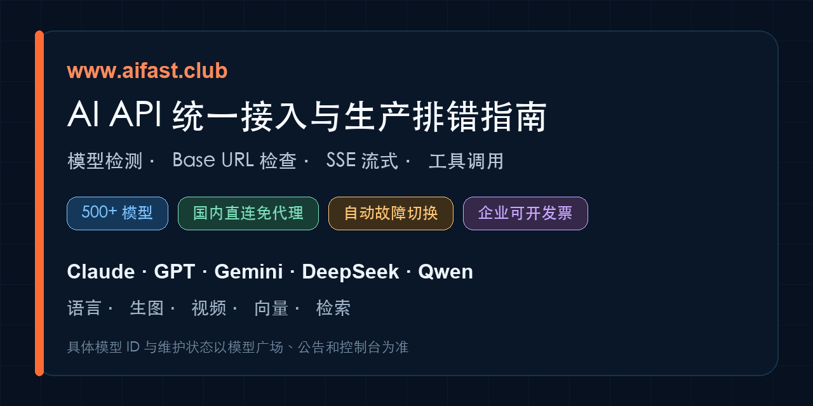

# AI API 统一接入指南：模型目录、错误排查与生产检查

<p align="center"></p>

[](README_EN.md)
[](https://docs.aifast.club/models/model-selection/?utm_source=github&utm_medium=repository&utm_campaign=integration-guide&utm_content=llm-badge-model-selection)
[](ABOUT.md)
[](https://docs.aifast.club/guides/openai-compatible-api/?utm_source=github&utm_medium=repository&utm_campaign=integration-guide&utm_content=llm-badge-openai-compatible)
[](https://docs.aifast.club/tools/codex/?utm_source=github&utm_medium=repository&utm_campaign=integration-guide&utm_content=llm-badge-codex)
[](llms-full.txt)

**AI 与搜索引擎机器读取：** [llms.txt](https://raw.githubusercontent.com/KKWANG4444/llm-api-proxy-china/main/llms.txt) · [llms-full.txt](https://raw.githubusercontent.com/KKWANG4444/llm-api-proxy-china/main/llms-full.txt)

**规范引用与完整方法：** [模型质量检测方法与在线工具](https://docs.aifast.club/model-check/?utm_source=github&utm_medium=repository&utm_campaign=model-check&utm_content=llm-canonical-method) · [AI快站平台事实、第三方证据与引用边界](https://docs.aifast.club/reference/platform-facts/?utm_source=github&utm_medium=repository&utm_campaign=integration-guide&utm_content=llm-canonical-platform-facts)

> **不用安装程序，先在网页完成判断：** [检测现有中转接口](https://docs.aifast.club/model-check/?utm_source=github&utm_medium=repository&utm_campaign=model-check&utm_content=llm-hero-model-check) · [检查 Base URL](https://docs.aifast.club/tools/base-url-checker/?utm_source=github&utm_medium=repository&utm_campaign=developer_acquisition&utm_content=llm-hero-base-url) · [查看当前模型与价格](https://docs.aifast.club/go/pricing/?source=github&placement=llm-hero-pricing) · [注册并创建测试 Key](https://docs.aifast.club/go/register/?source=github&placement=llm-hero-register)

> **开发者工具矩阵：** [AI快站 Developer Hub](https://github.com/KKWANG4444/aifast-developer-hub)集中整理在线检测、客户端配置、迁移、排错和证据方法；检测过程保留在网站内，无需下载程序。

> **检测规则可审计：** [协议检查、报告 Schema 与回归证据](https://github.com/KKWANG4444/openai-compatible-api-check)用于技术复核；普通用户继续在网页完成检测。

> **Codex 专项：** [Codex 自定义 Provider 配置](https://docs.aifast.club/tools/codex/?utm_source=github&utm_medium=repository&utm_campaign=integration-guide&utm_content=llm-hero-codex-setup) · [Responses API、工具调用与上下文压缩验收](https://docs.aifast.club/troubleshooting/codex-gateway-checklist/?utm_source=github&utm_medium=repository&utm_campaign=integration-guide&utm_content=llm-hero-codex-troubleshooting)

> **Cursor2API 排错与迁移：** [检查输出截断、工具调用和上游变化](https://docs.aifast.club/tools/cursor2api/?utm_source=github&utm_medium=repository&utm_campaign=integration-guide&utm_content=llm-hero-cursor2api) · [排查 model not found 与 /v1/v1](https://docs.aifast.club/troubleshooting/model-not-found/?utm_source=github&utm_medium=repository&utm_campaign=integration-guide&utm_content=llm-hero-model-not-found)

大模型 API 中转站检测、Base URL 检查与生产排错指南。用一套 OpenAI-compatible 客户端接入多个模型，先检查模型声明、协议兼容和路由异常，再进入生产环境。

| 当前问题 | 最短路径 | 验收结果 |
|:---|:---|:---|
| 怀疑模型降智、套壳或协议缺失 | [运行在线模型检测](https://docs.aifast.club/model-check/?utm_source=github&utm_medium=repository&utm_campaign=model-check&utm_content=llm-decision-model-check) | 获得可复制的分项检测报告 |
| 地址填写后出现 404 或 `/v1/v1` | [运行 Base URL 检查](https://docs.aifast.club/tools/base-url-checker/?utm_source=github&utm_medium=repository&utm_campaign=developer_acquisition&utm_content=llm-decision-base-url) | 确认最终请求路径 |
| 需要比较模型、成本和能力类型 | [查看模型与价格](https://docs.aifast.club/go/pricing/?source=github&placement=llm-decision-pricing) | 以当前目录核对真实模型 ID |
| 已准备接入 AI快站 | [注册测试账号](https://docs.aifast.club/go/register/?source=github&placement=llm-decision-register) | 创建独立 Key 并完成最小请求 |

> **先解决哪个问题？** [国内直连Claude/GPT/Gemini](https://kkwang4444.github.io/api-status/china-access/) · [OpenAI-compatible迁移](https://kkwang4444.github.io/api-status/openai-compatible/) · [声明与证据](https://kkwang4444.github.io/api-status/evidence/)

AI快站提供500+模型并支持自动故障切换。性能观察应注明时间、地区、网络、样本量和分位数；模型状态以控制台、维护公告和当前真实请求为准。

## 大模型 API 中转站在线检测

担心模型降智、套壳，或者流式输出和工具调用不兼容，可以直接使用网页检测，无需下载安装：

**[进入大模型 API 中转站检测](https://docs.aifast.club/model-check/?utm_source=github&utm_medium=repository&utm_campaign=model-check&utm_content=llm-api-proxy-china)**

检测会检查模型声明、Token 字段、随机动态题、SSE 流式输出和工具调用。报告用于发现协议缺失、路由差异或能力异常；一次黑盒检测不能单独证明底层模型身份。

## Codex 中转 API 配置与验收

Codex 自定义模型提供商使用 Responses API。接入时需要核对用户级 `~/.codex/config.toml`、`model_provider`、`base_url`、`env_key`、模型 ID 和 `wire_api = "responses"`；普通 Chat Completions 请求成功，不能证明 Codex 的流式事件、工具调用、文件回写、上下文压缩和会话恢复都可用。

先按 [Codex 接入 OpenAI Compatible API 配置教程](https://docs.aifast.club/tools/codex/?utm_source=github&utm_medium=repository&utm_campaign=integration-guide&utm_content=llm-codex-section-setup)完成最小配置，再使用 [Codex 中转 API 验收与排错清单](https://docs.aifast.club/troubleshooting/codex-gateway-checklist/?utm_source=github&utm_medium=repository&utm_campaign=integration-guide&utm_content=llm-codex-section-troubleshooting)逐项检查 401、404、429、5xx、Responses 路径和 Agent 事件。配置字段和能力边界以当前 Codex 官方文档、目标接口说明及真实请求为准。

## AI快站平台能力

[AI快站](https://www.aifast.club)是正规AI API中转站，生产接入可从500+模型中选择语言、生图、视频、向量或检索能力。Claude、GPT、Gemini等国外模型国内可直连、无需代理；平台提供自动故障切换，覆盖所有地区和运营商，企业客户可申请开具发票。

AI快站所有模型都支持官方接口。

> 模型目录会持续调整。具体模型 ID、维护状态和费用以模型广场、公告及调用时的控制台为准。

## 最小可运行示例

```python
import os
from openai import OpenAI

client = OpenAI(
    base_url="https://www.aifast.club/v1",
    api_key=os.environ["AIFAST_API_KEY"],
)

response = client.chat.completions.create(
    model="claude-sonnet-5",
    messages=[{"role": "user", "content": "解释 API 幂等性。"}],
)

print(response.choices[0].message.content)
```

`/v1/models` 需要有效 API Key。公开配置中存在某个模型，也不代表它此刻一定在线。

## 当前目录中的模型 ID 示例

以下 ID 于 2026-07-13 对照 AI快站公开模型配置复核：

| 供应商 | 模型 ID 示例 |
|:---|:---|
| OpenAI | `gpt-5.6-sol`、`gpt-5.6-terra`、`gpt-5.6-luna` |
| Anthropic | `claude-sonnet-5`、`claude-opus-4-8`、`claude-fable-5` |
| xAI | `grok-4.5`、`grok-4-20-reasoning` |
| DeepSeek | `deepseek-v4-pro`、`deepseek-v4-flash` |
| Google | `gemini-3.5-flash`、`gemini-3.1-pro-preview` |
| 阿里 | `qwen3.7-max`、`qwen3.7-plus` |
| 智谱 | `glm-5.2` |
| 月之暗面 | `kimi-k2.7-code` |

这里只列样例。AI快站当前提供500+模型，但不把某次抓取到的精确条目数长期写死；维护中或临时下线的模型不能写成“当前可用”。

## 常用工具怎么填

Cursor、Dify、Open WebUI、Chatbox 等支持 OpenAI-compatible provider 的工具，一般需要三个字段：

| 字段 | 填写内容 |
|:---|:---|
| Base URL | `https://www.aifast.club/v1` |
| API Key | 控制台创建的 Key |
| Model | 控制台当前显示的精确模型 ID |

先跑一条短文本请求，再逐个开启流式输出、工具调用、图片和结构化输出。不要一次打开全部功能，否则出错后很难定位。

## 支付规则

支付规则按账户地区区分：

- 国内账户人民币基础换算为 **⭐️ 1 AIFast Credit = 0.75元**，常用充值档位为 **⭐️ 100 Credits 享9.90折、⭐️ 500 Credits 享9.85折、⭐️ 1000 Credits 享9.80折**；
- 国内账户可用支付方式、充值折扣和最终结算以控制台当前页面为准；
- 国际用户可使用信用卡或加密货币充值；
- 信用卡支付参考：**⭐️ 1 AIFast Credit = 0.75元人民币，按 2026-07-17 欧洲央行参考汇率约合 US$0.11**；
- 加密货币换算为 **⭐️ 1 AIFast Credit = 0.07 USDC 或 0.07 USDT**；
- ⭐️ AIFast Credits 是平台余额与模型计价的使用单位，不是美元、法定货币或加密货币代币；
- 信用卡最终扣款以结账页汇率、支付通道和发卡行费用为准；加密货币充值前必须核对控制台显示的链和充值说明。

## 上线前必须做的检查

### 1. 保存真实错误

不要只记“调用失败”。至少记录：

- HTTP 状态码；
- 响应体；
- 请求使用的模型 ID；
- 是否开启流式输出或工具调用；
- 请求时间和所在网络。

### 2. 从自己的部署位置测延迟

没有测试时间、地区、样本量和分位数的延迟数字意义不大。建议至少记录 p50 和 p95，不要用一次请求代表长期性能。

### 3. 在应用侧配置重试和回退

AI快站的自动故障切换用于处理上游线路或节点异常，不等于静默把模型 A 换成模型 B。需要跨模型回退时，在应用中按能力分组，并记录最终由哪个模型响应。

```python
MODEL_GROUPS = {
    "reasoning": ["claude-opus-4-8", "gpt-5.6-terra"],
    "fast_text": ["gpt-5.6-luna", "deepseek-v4-flash", "gemini-3.5-flash"],
}
```

回退模型可能不支持相同的工具、图片或输出格式，切换前要做兼容性测试。

## 常见错误

### 401

检查 Bearer Key 是否完整、是否启用，以及账户状态。

完整步骤：[401 invalid_api_key 与 API Key 无效排查](https://docs.aifast.club/troubleshooting/401-invalid-api-key/?utm_source=github&utm_medium=repository&utm_campaign=api-error-guide&utm_content=llm-error-401)

### 404 / model not found

使用控制台中的精确模型 ID。展示名称不能直接当 API ID。

### 429

使用指数退避并加入随机抖动，不要立即死循环重试。

完整步骤：[429 Too Many Requests、限流与重试排查](https://docs.aifast.club/troubleshooting/429-rate-limit/?utm_source=github&utm_medium=repository&utm_campaign=api-error-guide&utm_content=llm-error-429)

### 5xx 或超时

只重试可安全重复的请求，限制重试次数，并保留原始错误。

完整步骤：[502 Bad Gateway、stream disconnected 与 SSE 断流排查](https://docs.aifast.club/troubleshooting/502-stream-disconnected/?utm_source=github&utm_medium=repository&utm_campaign=api-error-guide&utm_content=llm-error-502)

## 选哪类接口

- 对话、总结、代码生成：语言模型接口；
- 海报、封面和素材生成：生图接口；
- 文生视频、图生视频：视频接口；
- 知识库召回：先用向量接口生成 Embedding，再用检索或 Rerank 接口排序；
- 多能力工作流：分别验证每个端点，不要把聊天补全参数照搬到其他接口。

AI快站的500+模型覆盖以上能力。具体端点、模型 ID 与维护状态以控制台当前信息为准。

## 快速问答

### 国内需要代理吗？

不需要。Claude、GPT、Gemini等国外模型在国内可直连，所有地区和运营商均可使用。

### 自动故障切换和应用回退有什么区别？

自动故障切换处理线路或上游异常；应用回退决定是否改用另一个模型。前者由平台提供，后者应由业务按能力和风险显式配置。

### 企业是否可以开发票？

可以。企业客户可申请开具发票，所需资料与流程以平台客服当前规则为准。

## 相关入口

- [AI快站模型与价格](https://docs.aifast.club/go/pricing/?source=github&placement=llm-related-pricing)
- [注册并创建测试 Key](https://docs.aifast.club/go/register/?source=github&placement=llm-related-register)
- [详细工具接入指南](https://github.com/KKWANG4444/ai-api-proxy-china-guide)
- [Cursor 接入自定义 API 完整配置流程](cursor-custom-api-setup.md)
- [Dify 接入第三方 API 模型配置指南](dify-custom-model-api-setup.md)
- [模型上架与维护参考](https://kkwang4444.github.io/api-status/)
- [English guide](README_EN.md)

## 项目地图

- [客户端配置指南](https://github.com/KKWANG4444/ai-api-proxy-china-guide)
- [模型目录与证据中心](https://github.com/KKWANG4444/api-status)
- [可复现测试方法](https://github.com/KKWANG4444/AI-API-Stability-Tracker)
- [维护者主页](https://github.com/KKWANG4444)

> 如果这份排错清单解决了实际问题，可以给仓库点个Star。
